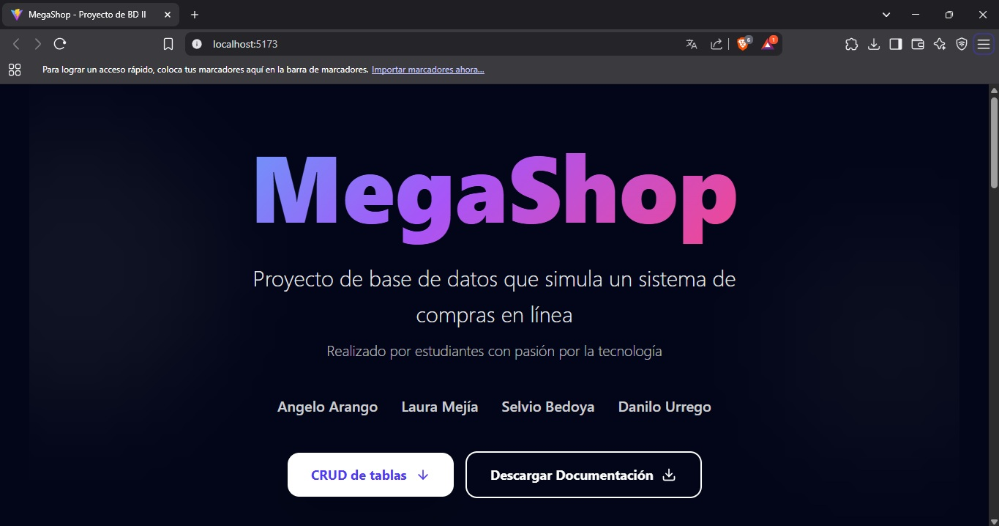

# 🛒 MegaShop

Proyecto de Base de Datos II – Simulación de un sistema de compras en línea.

## 🧠 Descripción

Este proyecto consiste en una plataforma que simula el funcionamiento de una tienda virtual, enfocándose en el diseño y gestión eficiente de la base de datos.

## 🚀 Tecnologías

- **React:** Plataforma moderna, rápida y escalable.
- **JavaScript:** Lenguaje versátil para el desarrollo del frontend.
- **Firebase - Firestore:** Base de datos NoSQL en tiempo real.
- **TailwindCSS:** Framework de estilos altamente personalizable.

## 📄 Documentación

Puedes descargar el documento con el diseño y explicación de la base de datos haciendo clic [aquí](./assets/Documentación%20-%20Base%20de%20datos%20MegaShop.pdf) o en el botón de la landing page.

## 👥 Integrantes

- Danilo Urrego David  
- Angelo Arango  
- Selvio Bedoya  
- Laura Mejía  